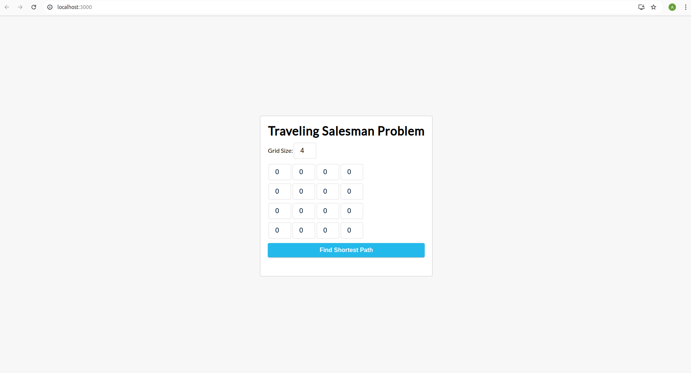
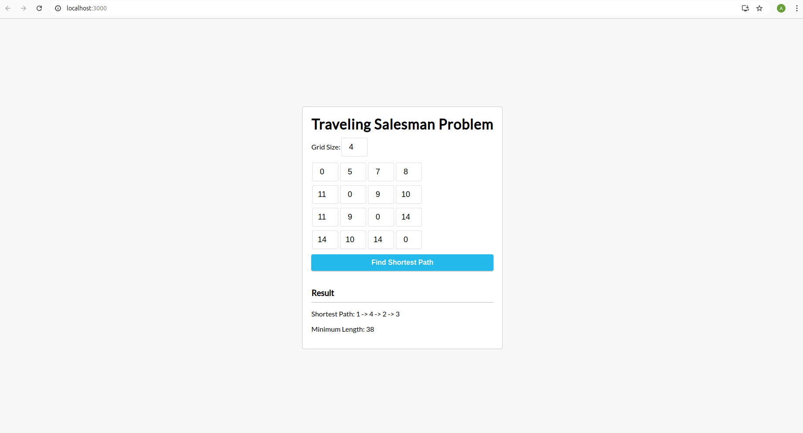

# Traveling Salesman Problem Solver

## Overview

This React application is designed to solve the Traveling Salesman Problem (TSP). It calculates the shortest possible route that visits a set of cities and returns to the origin city, minimizing the total travel cost. The app provides visual results including the shortest route and minimum cost.

## Features

- **Solve TSP:** Efficiently computes the shortest path visiting all cities.
- **Visual Results:** Displays the shortest route and total cost on an interactive map.

## Screenshots

*Starting*

*Results displaying shortest route and minimum cost.*

## Installation

1. **Clone the repository:**

   git clone https://github.com/abhikdass/travelingsalesman
Navigate into the project directory:

    cd travelingsalesman

Install dependencies:

    npm install
Usage
Start the application:

    npm start
Open your browser and go to:

    http://localhost:3000
Input your cities and distances into the application interface to calculate the shortest route.

How It Works
Input Data: Users can input a set of cities and their distances.
Solve TSP: The app uses an algorithm (e.g., dynamic programming or heuristic methods) to find the optimal route.
Display Results: Shows the shortest route on a map and provides the total minimum cost.
Technologies Used
React: For building the user interface.
JavaScript: For implementing the TSP solving algorithm.
Contributing
Contributions are welcome! If you have suggestions or improvements, please create a pull request or open an issue.

Contact
For any questions or feedback, feel free to contact me at  dasabhik35@gmail.com
